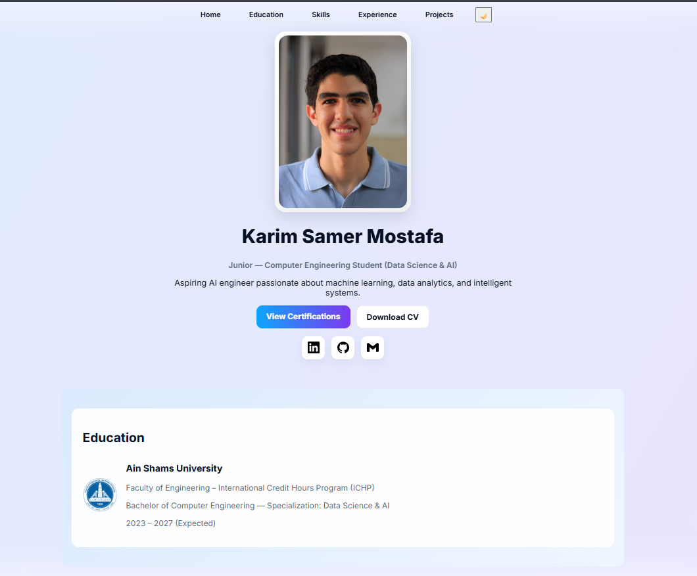

# 🚀 Personal Portfolio Website

A modern, responsive portfolio website built with HTML, CSS, and JavaScript. Features a clean design with smooth animations and dark mode support.



## 🌐 Live Demo
[View Live Website](https://karimsamer-portfolio.netlify.app/)

## ✨ Features
-  Clean and modern UI design
-  Dark/Light mode toggle
-  Fully responsive layout
-  Smooth scroll animations
-  Intersection Observer for reveal effects
-  CSS gradient animations
-  Fast loading performance
-  Scroll to top functionality

##  Technologies
- HTML5
- CSS3 (Custom properties, Flexbox, Grid)
- Vanilla JavaScript
- Intersection Observer API
- Google Fonts
- Netlify Hosting

## 📦 Project Structure
```
portfolio/
├── index.html          # Main HTML file
├── style.css          # Styles and animations
├── script.js         # JavaScript functionality
└── assets/          # Images and icons
```

## 🚀 Quick Start
1. Clone the repository
```bash
git clone https://github.com/karimsamer100/portfolio.git
```
2. Open `index.html` in your browser
3. Start customizing the content

##  Development
- No build process required
- Edit HTML/CSS/JS files directly
- Use Live Server for local development

##  License
MIT License - feel free to use this project as a template for your portfolio!

## 🤝 Connect With Me
- [LinkedIn](https://www.linkedin.com/in/karim-samer-5965672b2/)
- [GitHub](https://github.com/karimsamer100)
- [Email](mailto:karimsamer100@gmail.com)