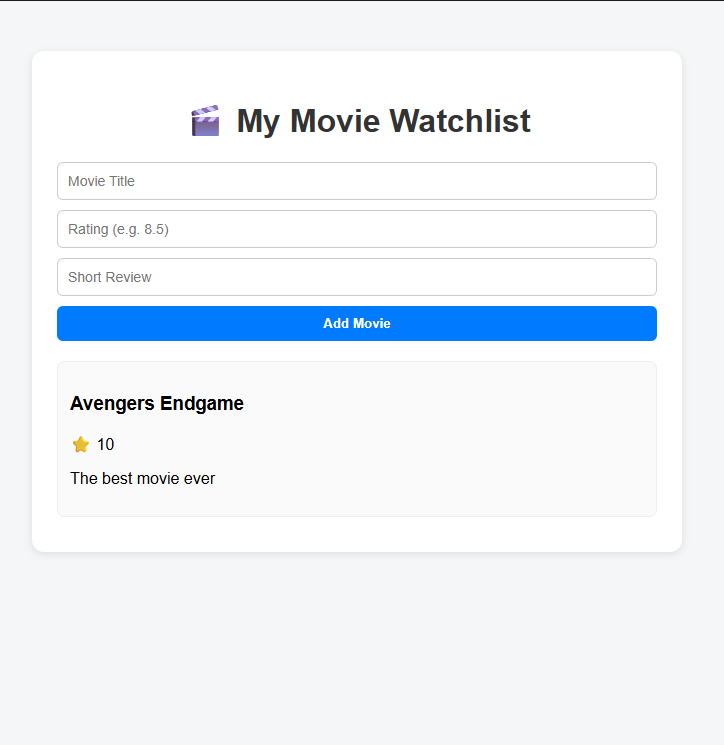

# 🎬 React Movies Watchlist

A clean and interactive movie watchlist application built with React. Add your favorite movies, their ratings, and short reviews in a beautiful, responsive interface.


*(Note: Add Preview.png to your repository to show the app screenshot here)*

## ✨ Features
- Clean and modern UI design
- Add movies with ratings and reviews
- Responsive layout for all devices
- Smooth animations on hover
- Empty state handling
- Modern React Hooks usage
- Beautiful CSS styling

## 🛠 Technologies
- React 18
- CSS3 (Flexbox, Custom Properties)
- Vite (Development Server & Builder)
- Node.js & npm

## 📦 Project Structure
```
react-movies-list/
├── index.html       # Entry HTML with root div
├── index.jsx        # React application code
├── styles.css      # UI styling and animations
└── Preview.png     # (Add this: app screenshot)
```

## 🚀 Quick Start

1. Clone the repository
```bash
git clone [your-repo-url]
```

2. Install dependencies
```bash
npm init -y
npm install --save-dev vite
npm install react react-dom
```

3. Add this line to index.html (in body):
```html
<script type="module" src="/index.jsx"></script>
```

4. Start the development server
```bash
npx vite
```

5. Open http://localhost:5173 in your browser

## 🔧 Development
- Uses Vite for fast development & builds
- Edit React code in `index.jsx`
- Style modifications in `styles.css`
- Hot Module Replacement enabled

## 🏗 Building for Production
```bash
npx vite build
npx vite preview  # Test the production build
```

## 📝 License
MIT License - feel free to use this project for your own watchlist!

## 🤝 Connect With Me
- [LinkedIn](your-linkedin-url)
- [GitHub](your-github-url)
- [Email](mailto:your-email)

*(Remember to add Preview.png and update the social links with your information)*